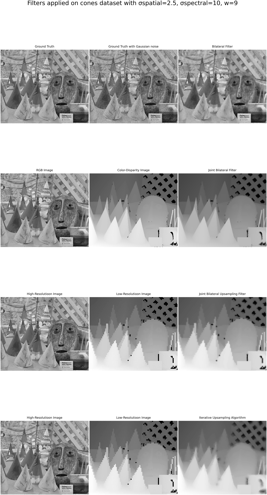
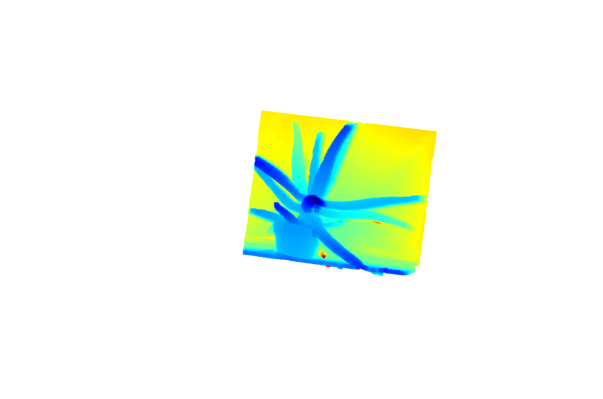
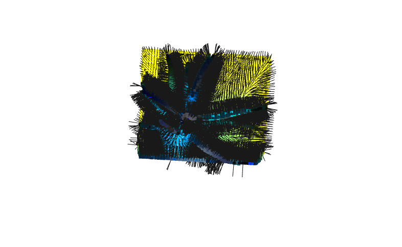
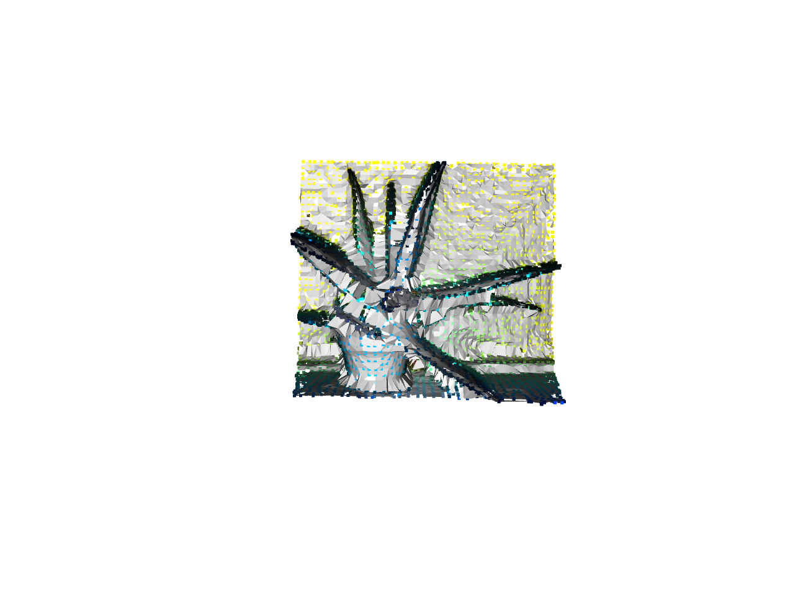

# Image Filtering and Upsampling

## Overview
This project implements several filters and methods that aim to enhance image quality by reducing noise while preserving edges and to improve resolution through upsampling techniques. Demonstrations on the Cones dataset illustrate the effects of each method.

## Demonstrations
Below is a demonstration of the mentioned methods applied to the Cones dataset.




## GUI for Parameter Tuning
A user-friendly graphical interface allows for interactive tuning of upsampling filter parameters, supporting real-time experimentation to find optimal settings for `window_size` and `sigma_spectral`.


## Point Cloud and Surface Reconstruction
The Iterative Upsampling approach is used to upsample depth maps and generate 3D reconstructions:

- **Point Clouds** 
- **Oriented Point Clouds** 
- **Triangulated Surfaces** 

## Setup and Usage
Clone the repository and build it as follows:

```bash
git clone https://github.com/username/Image_Filtering_Upsampling.git
cd Image_Filtering_Upsampling
mkdir build
cd build
cmake ..
make
```
To run the filters:
```bash
./filters mode input_image_path guide_image_path output_directory window_size sigma_range
# Example:
./filters 1 ../images/Lena/lena.png ../images/Lena/lena.png ../results/Lena/JBF/ 5 51.8

```
To launch the GUI for interactive upsampling:
```bash
./upsampling_gui mode low_res_img_path high_res_img_path
# Example:
./upsampling_gui 1 ../images/Aloe/disp1.png ../images/Aloe/view1.png
```


